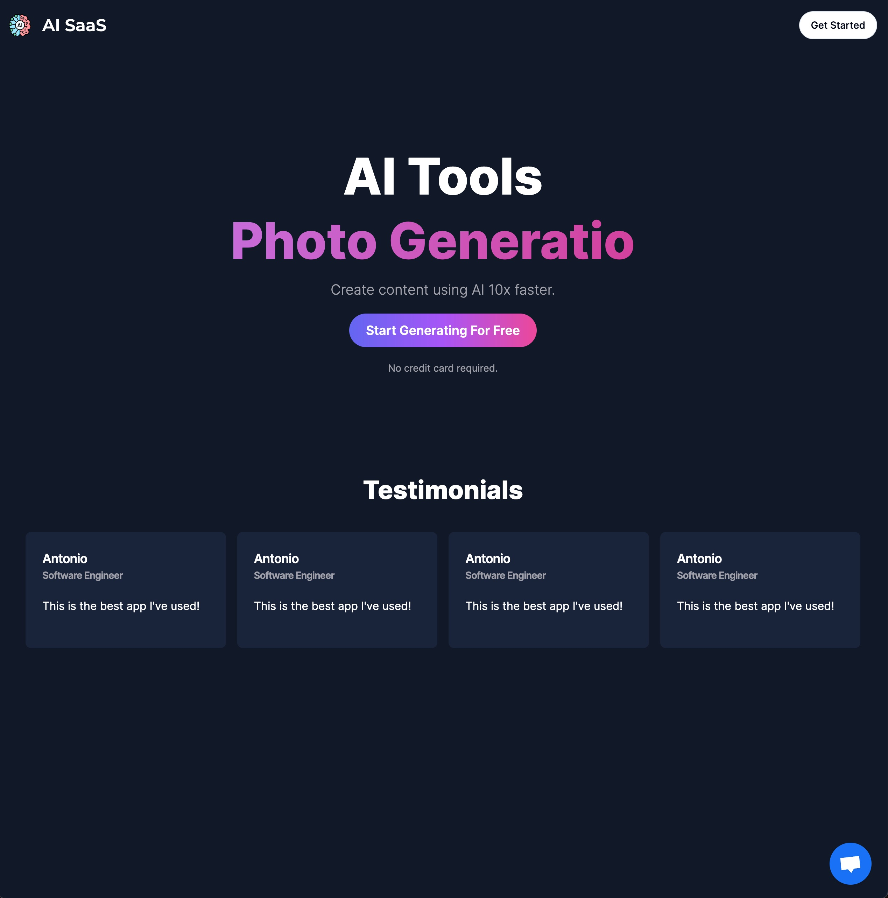
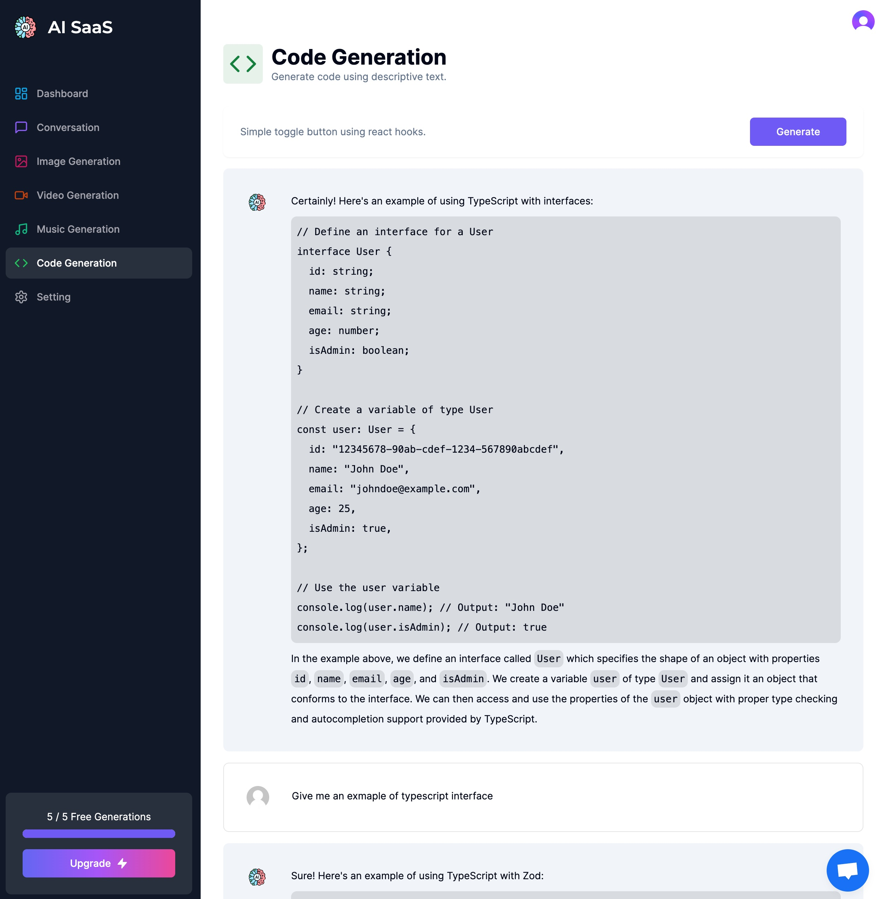
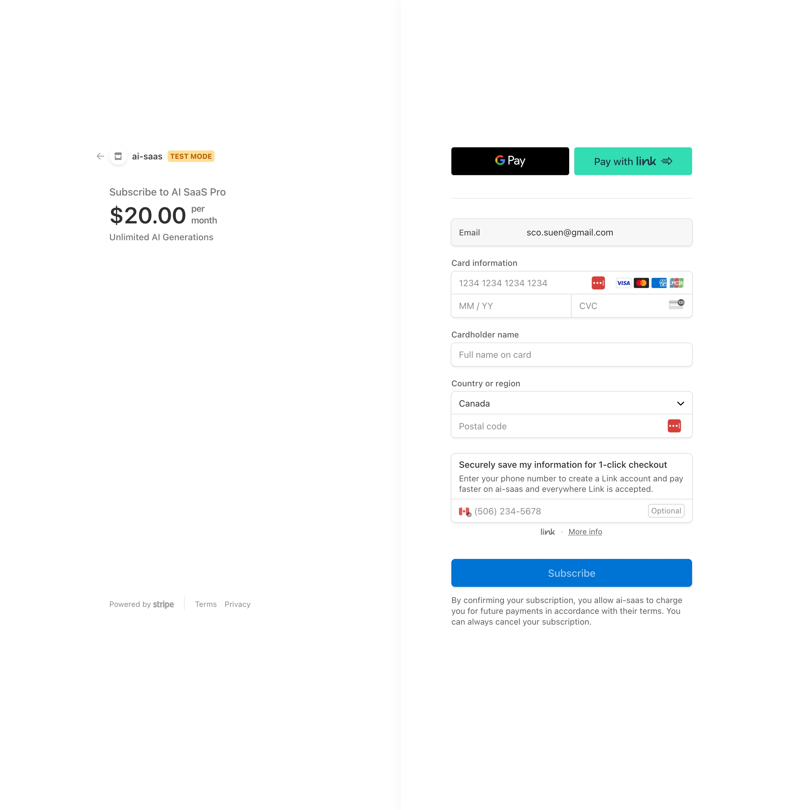
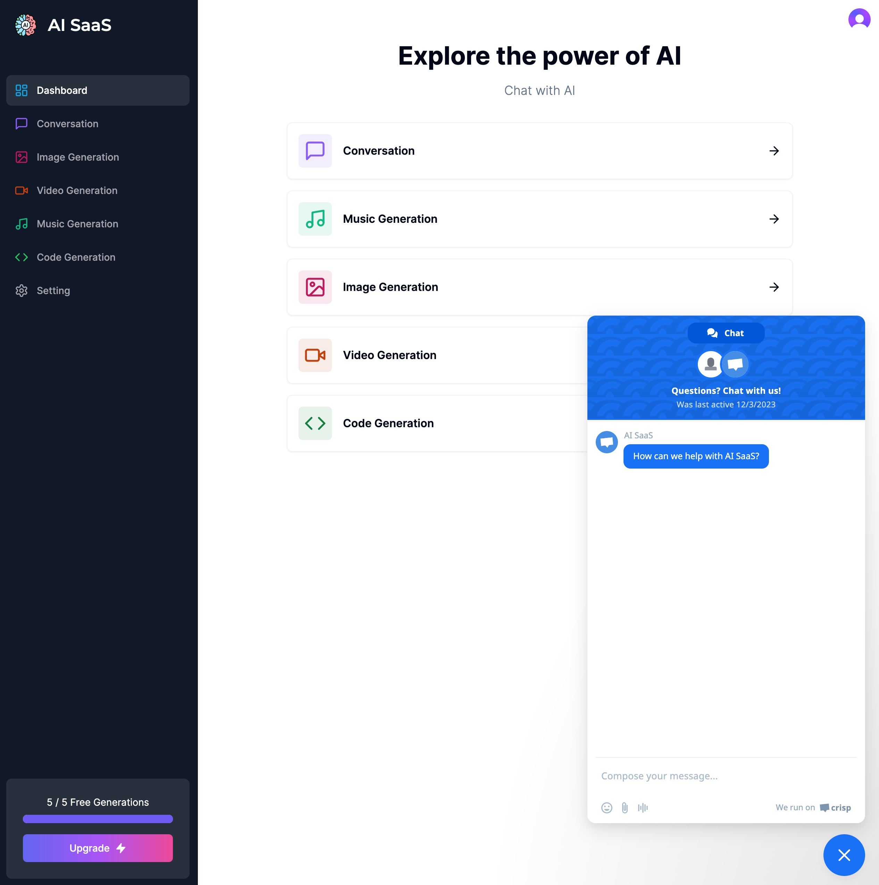
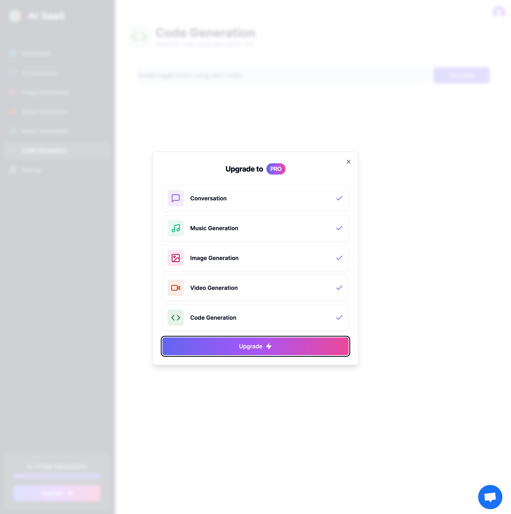
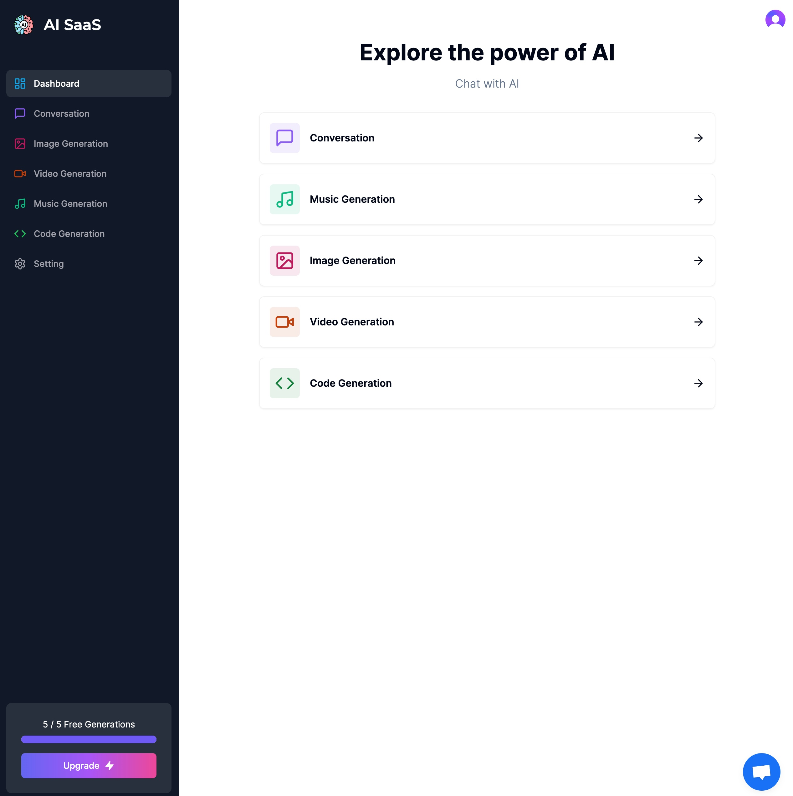
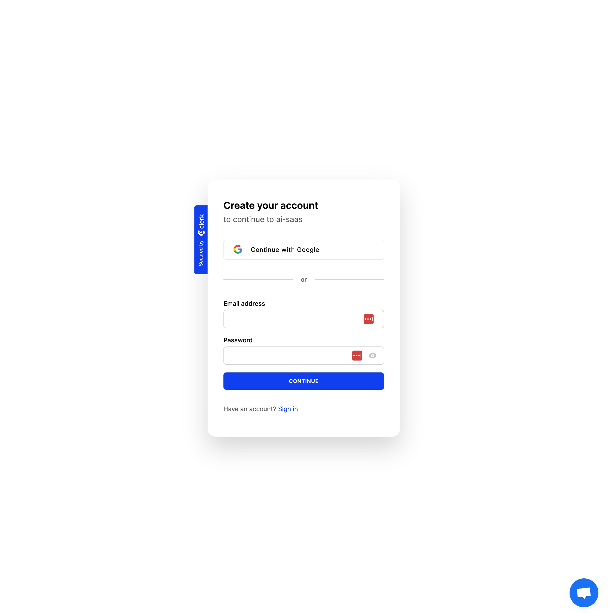
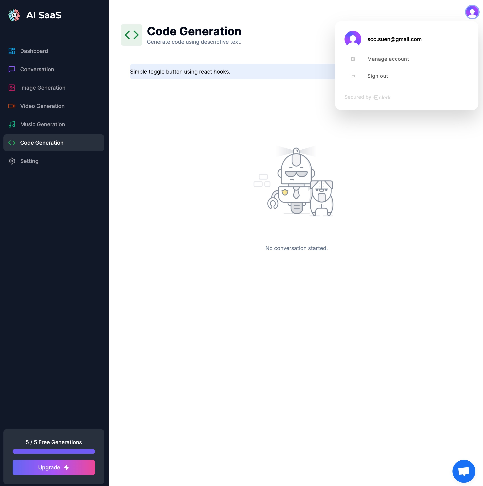
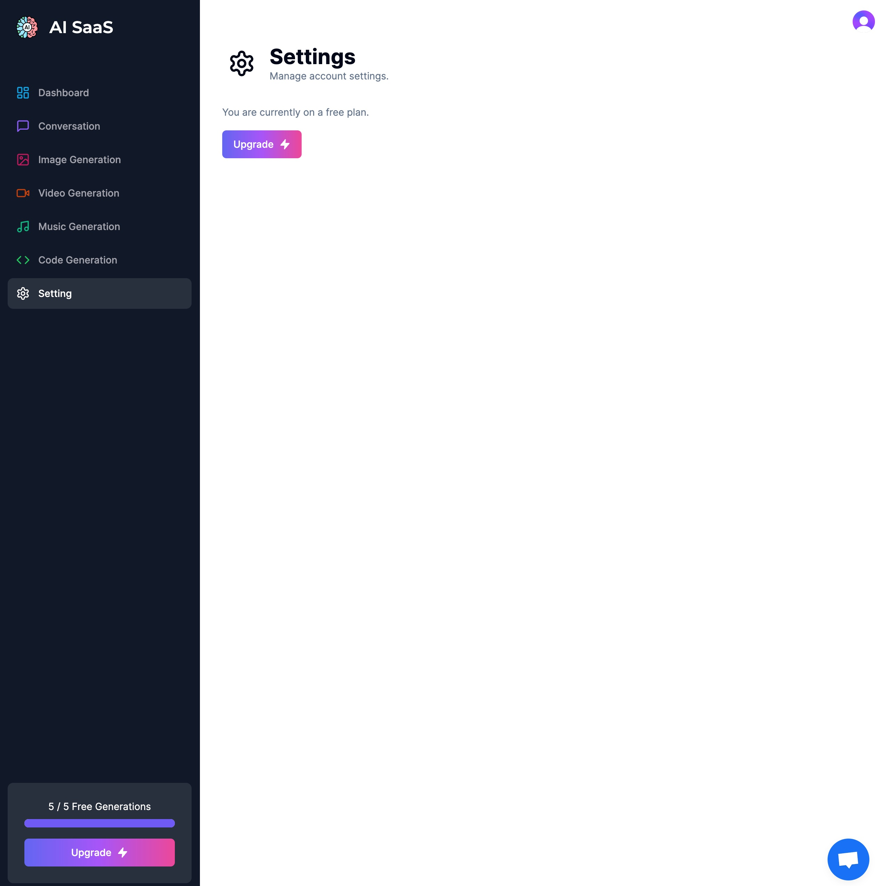

# Summary
Revolutionize your digital experience with AI-driven conversation, code, image, music, and video generation. Effortlessly manage subscriptions, sign up, and connect with customer support for personalized assistance. 

# Teck Stack
- [OpenAI API](https://platform.openai.com/)
- [Stripe](https://stripe.com/)
- [clerk](https://clerk.com/)
- [crisp](https://crisp.chat/en/chatbot/)
- [PlanetScale](https://planetscale.com/)
- MySQL
- NextJS 14
- axios
- [react-hot-toast](https://github.com/timolins/react-hot-toast)
- [react-markdown](https://github.com/remarkjs/react-markdown)
- [TypewriterJS v2](https://github.com/tameemsafi/typewriterjs)
- [zustand](https://github.com/pmndrs/zustand)
- [Prisma](https://www.prisma.io/)

# Features
- AI Generation
  - Conversation
  - Code Generation
  - Image Generation
  - Music Generation
  - Video Generation
- Payment
  - Subscription
  - Cancel subscription
- User Management
  - Sign up
  - Sign in
  - Sign out
  - Manage account
- Customer Support
  - Chat with Customer Service online

## Screenshots
- Landing page
  
- Code Generation
  
- Sbuscription Payment
  
- Customer Service
  
- Upgrade Modal
  
- Welcome Page
  
- Sign In
  
- Sign Out
  
- Settings
  

# Getting Started
1. Installation
  ```shell
  npm install
  ```
2. Run the development server
  ```shell
  npm run dev
  ```
3. Open page with your browser to see the result.
  [http://localhost:3000](http://localhost:3000)

4. DB tool
  ```shell
  npx prisma studio
  ```

# Reference
The project is based on this [YouTube Tutorial](https://youtu.be/ffJ38dBzrlY?si=v2viBUN_qJIb0m-Z)
